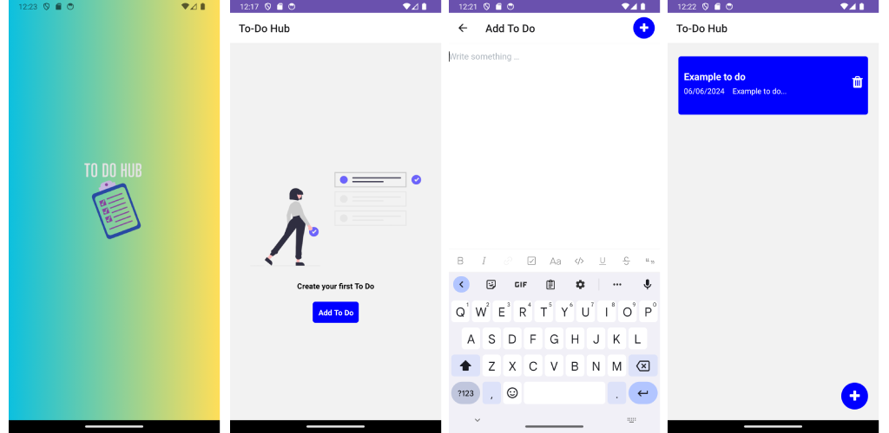

# To-Do-Hub
React Native Expo Android App

Download Android App : https://play.google.com/store/apps/details?id=com.todohub

Welcome to To-Do-Hub, a simple to-do list mobile application built with React Native Expo! 
This repository contains the source code for the To-Do-Hub app. 
NB: This app is will  get future updates 

Follow this guide to set up the project on your local machine.
Prerequisites

Before you begin, ensure you have the following installed on your system:

    Node.js (v14 or later)
    npm (v6 or later)
    Expo CLI (install using npm install -g expo-cli)
    Android Studio (for Android development)
    Git (optional, but recommended)

Installation

Follow these steps to set up the project on your local machine:
1. Clone the repository

git clone https://github.com/d0nda/To-Do-Hub.git

    cd To-Do-Hub

2. Install dependencies

Navigate to the project directory and install the required dependencies:

    npm install

3. Start the Expo development server:

        npm start

This will start the Expo development server and open a new tab in your default web browser.
4. Run the app on Android

    Make sure you have an Android emulator running, or connect your Android device via USB with USB debugging enabled.
    Press a in the terminal where the Expo server is running to launch the app on the Android emulator or connected device.

Usage

You should now have the To-Do-Hub app running locally on your machine. Explore the app, create tasks, mark them as completed, and organize your to-do lists. Enjoy the simplicity and productivity that To-Do-Hub offers!

Contributing

If you'd like to contribute to this project, feel free to fork the repository and submit a pull request with your changes.

License

This project is licensed under the MIT License.

Support

If you encounter any issues or have any questions, please open an issue on GitHub.

Thank you for using To-Do-Hub! We hope it helps you stay organized and productive.
